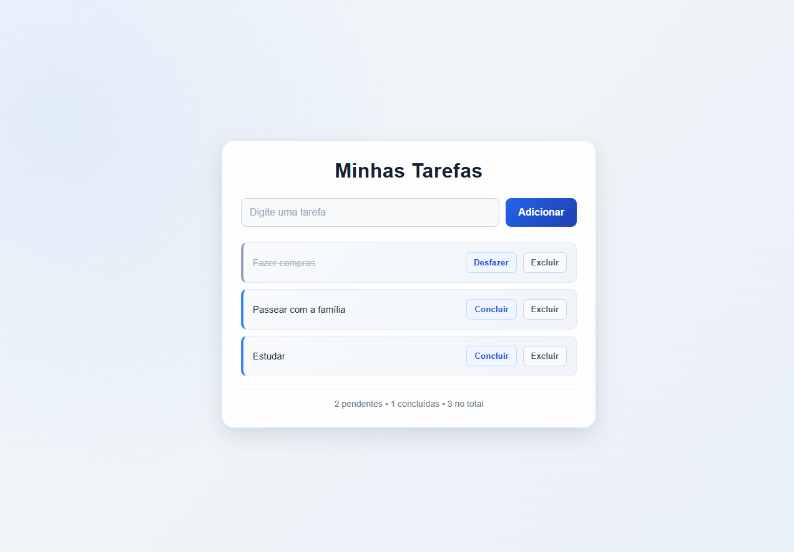

# 📝 Lista de Tarefas

Uma aplicação web responsiva para gerenciamento de tarefas, desenvolvida com **HTML, CSS e JavaScript**.

O projeto permite adicionar, concluir, desfazer e excluir tarefas, mantendo os dados salvos no navegador através do **Local Storage**.

## 🌐 Projeto online

🔗 [Acesse a aplicação](https://thiago-alvesdev.github.io/To-do-list/)

## 🚀 Funcionalidades

- Adicionar novas tarefas
- Adicionar tarefas pressionando a tecla Enter
- Marcar tarefas como concluídas
- Desfazer tarefas concluídas
- Excluir tarefas
- Contador de tarefas pendentes, concluídas e totais
- Persistência dos dados utilizando Local Storage
- Interface responsiva para computadores e dispositivos móveis

## 💻 Tecnologias utilizadas

- HTML5
- CSS3
- JavaScript
- Local Storage
- Git
- GitHub

## 📚 Conceitos praticados

Durante o desenvolvimento deste projeto, foram praticados conceitos fundamentais de desenvolvimento Front-End, como:

- Manipulação do DOM
- Eventos com `addEventListener`
- Funções
- Arrays e objetos
- Métodos de array como `push()`, `splice()`, `filter()` e `forEach()`
- Criação dinâmica de elementos HTML
- Manipulação de classes CSS com JavaScript
- Conversão de dados com `JSON.stringify()` e `JSON.parse()`
- Armazenamento de dados com Local Storage
- Renderização da interface baseada no estado da aplicação
- Responsividade com CSS
- Versionamento de código com Git e GitHub

## 📂 Estrutura do projeto

```text
To-do-list/
├── assets/
│   └── screenshot.png
├── index.html
├── style.css
├── script.js
└── README.md
```

## ▶️ Como executar

1. Clone este repositório:

```bash
git clone https://github.com/Thiago-AlvesDEV/To-do-list.git
```

2. Abra a pasta do projeto.

3. Abra o arquivo `index.html` no navegador.

Também é possível executar o projeto utilizando a extensão **Live Server** no Visual Studio Code.

## 💾 Armazenamento das tarefas

As tarefas são armazenadas no **Local Storage** do navegador.

Isso significa que elas continuam disponíveis mesmo após atualizar ou fechar a página.

Os dados são armazenados localmente no dispositivo e navegador utilizados, portanto não são sincronizados entre diferentes dispositivos.

## 📱 Responsividade

A interface foi desenvolvida para se adaptar a diferentes tamanhos de tela, permitindo o uso tanto em computadores quanto em dispositivos móveis.

## 📸 Demonstração



## 👨‍💻 Autor

**Thiago Alves**

GitHub: [Thiago-AlvesDEV](https://github.com/Thiago-AlvesDEV)